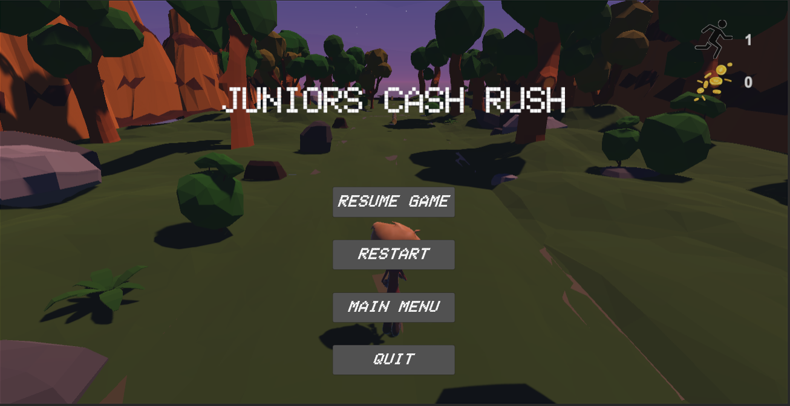
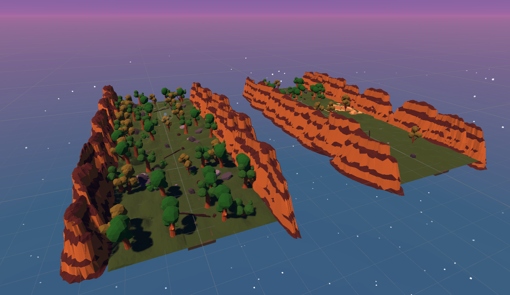
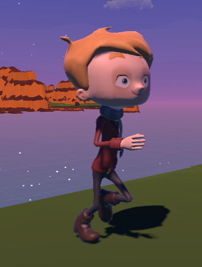

# Readme für "Juniors Cash Rush"
Eine Ausarbeitung von Mike Hammer.
English below.

## Inhaltsverzeichnis
1. [Beschreibung](#beschreibung)
2. [Steuerung](#steuerung)
3. [Spielmechanik](#spielmechanik)
4. [Screenshots](#screenshots)
5. [Installation](#installation)
6. [Quellen](#quellen) 
7. [Quellcodestruktur](#quellcodestruktur)

## Beschreibung
"Juniors Cash Rush" ist ein Endless Runner Spiel, das im Rahmen des Moduls Spieleprogrammierung an der Hochschule Osnabrück entwickelt wurde. Inspiriert von beliebten Endless Runner-Spielen wie Temple Run, Subway Surfer und Timmy and Mouse, bietet "Juniors Cash Rush" ein spannendes Spielerlebnis, bei dem der Spieler Hindernissen ausweichen und Münzen sammeln muss, um seinen Highscore zu verbessern. Das Spiel wird zudem herausfordernder, da es teilweise dunkel wird und die Sicht eingeschränkt ist.

**Der kleine Junior muss nach Hause rennen. Er bemerkt mit großem Schrecken, dass er auf dem Weg sein ganzes Taschengeld verloren hat! Hilf ihm, alle Münzen wieder einzusammeln und sicher nach Hause zu gelangen. Doch sei vorsichtig, denn die Sonne neigt sich langsam dem Horizont entgegen, und die Dunkelheit bricht bald herein.**

Tauche ein in das fesselnde Abenteuer von "Juniors Cash Rush"! Begleite den tapferen kleinen Junior auf seiner aufregenden Reise durch eine farbenfrohe Welt voller Hindernisse und Schätze. Deine Mission ist es, die verlorenen Münzen einzusammeln und gleichzeitig den Gefahren auszuweichen, die sich ihm in den Weg stellen.

Bereit für das ultimative Runner-Erlebnis? Setze die Steuerung präzise ein, um Junior geschickt durch das Labyrinth aus Hindernissen zu navigieren. Drücke die W-Taste oder die Pfeiltaste nach oben, um majestätisch über Barrieren zu springen. Nutze die A- und D-Tasten oder die Pfeiltasten nach links und rechts, um seitliche Ausweichmanöver zu meistern. Doch vergiss nicht, auch nach unten zu schauen - drücke die S-Taste oder die Pfeiltaste nach unten, um geschickt unter niedrigen Hindernissen hindurchzutauchen, falls dies erforderlich sein sollte.

**Sammle so viele Münzen wie möglich, um Juniors Taschengeld wieder aufzufüllen und seinen Highscore zu erhöhen!** Jede Münze zählt, um seine Enttäuschung über den Verlust seines Geldes zu mildern. Doch sei auf der Hut, denn das Abenteuer wird noch anspruchsvoller, wenn die Nacht hereinbricht. Die Umgebung wird allmählich in Dunkelheit getaucht, und die Sicht wird eingeschränkt. Trainiere deine Reflexe und deine Fähigkeit, auch im Dunkeln präzise zu agieren. Nur die besten Spieler können in dieser Herausforderung bestehen und Junior sicher nach Hause bringen.

Also schnüre deine Laufschuhe, halte die Augen offen und stürze dich in "Juniors Cash Rush"! Die atemberaubende Grafik und die mitreißende Musik werden dich in die Welt des kleinen Juniors eintauchen lassen. Erlebe den Nervenkitzel des Endless Runners, inspiriert von den Klassikern Temple Run, Subway Surfer und Timmy and Mouse.

**Worauf wartest du noch? Lade das Spiel jetzt herunter, hilf Junior, seine Münzen wiederzufinden, und beweise deine Geschicklichkeit, wenn die Dunkelheit hereinbricht. Viel Spaß bei "Juniors Cash Rush" - dem Endless Runner der Extraklasse!**
## Steuerung
- W oder Pfeiltaste nach oben oder Space: Springen
- A oder Pfeiltaste nach links: Nach links bewegen
- D oder Pfeiltaste nach rechts: Nach rechts bewegen

## Spielmechanik
- Vermeide Hindernisse: Weiche den verschiedenen Hindernissen aus, die sich dir in den Weg stellen, um dein Spiel fortzusetzen.
- Münzen sammeln: Sammle so viele Münzen wie möglich, um deinen Highscore zu erhöhen.
- Dunkelheit: In einigen Abschnitten wird es dunkel, was die Sicht erschwert und das Spiel schwieriger macht. Meistere die Kunst des Laufens im Dunkeln, um erfolgreich zu sein!

## Screenshots

## Installation
1. Lade die neueste Version von "Juniors Cash Rush" von der [GitHub-Seite](https://github.com/mikexhammer/Juniors-Cash-Rush) herunter.
2. Entpacke das Archiv an einem Ort deiner Wahl.
3. Öffne Unity und wähle "Open Project". Navigiere zu dem Ort, an dem du das Spiel entpackt hast.
4. Nachdem das Projekt geladen wurde, navigiere zum Ordner "Scenes" und öffne die Hauptspiel-Szene.
5. Drücke den Play-Button, um das Spiel im Unity-Editor zu starten und das Endless Runner-Abenteuer zu erleben!

## Quellen
- Inspiriert von Temple Run: [https://www.imangi.com/temple-run](https://www.imangi.com/temple-run)
- Inspiriert von Subway Surfers: [https://www.subwaysurfers.com](https://www.subwaysurfers.com)
- Inspiriert von Timmy and Mouse: https://www.youtube.com/watch?v=fBK2oJdBGB0
- Verwendete Assets:
        https://assetstore.unity.com/packages/3d/props/gold-coins-1810
        https://assetstore.unity.com/packages/3d/simple-sky-cartoon-assets-42373
        https://assetstore.unity.com/packages/vfx/shaders/free-skybox-extended-shader-107400
        https://assetstore.unity.com/packages/3d/environments/lowpoly-rocks-137970
        https://assetstore.unity.com/packages/3d/vegetation/plants/lowpoly-flowers-47083
        https://assetstore.unity.com/packages/3d/environments/landscapes/lowpoly-environment-pack-99479
- Character und Animation:
        https://www.mixamo.com
- Ton und Musik:
        https://getsoundly.com

## Quellcodestruktur
Das Projekt "Juniors Cash Rush" besteht aus verschiedenen Abschnitten, die den Quellcode organisieren und die Funktionalität des Spiels gewährleisten. Die wichtigsten Abschnitte sind Levelhandler, Player, StartSegment und Segments. Jeder dieser Abschnitte spielt eine entscheidende Rolle im Spiel und ist verantwortlich für verschiedene Aspekte des Gameplays.

### Levelhandler
Der Levelhandler ist das zentrale Objekt, das das Spielprinzip verwaltet und verschiedene Objekte im Spiel hält. Dazu gehören:
Obejekte:
- **Sound:** Verwaltet die Soundeffekte und Hintergrundmusik des Spiels.
- **UI:** Verantwortlich für die Benutzeroberfläche, die dem Spieler Informationen über den aktuellen Zustand des Spiels liefert.
- **Sun (DirectionalLight):** Lichtquelle des Spiels, wird durch Tag und Nacht Zyklus manipuliert.
Skripte:
- **LevelGrenze:** Definiert die Breite des Spielfeldes, die der Spieler nicht überschreiten darf.
- **Erzeugung zufälliger Level:** Generiert zufällige Level, indem es Objekte aus einem Array mit gehaltenen LevelObjekten auswählt.
- **Distance und Gold Counter:** Zählt die zurückgelegte Strecke und die eingesammelten Münzen des Spielers.
-**Tag und Nacht Zyklus:** Manipuliert die X-Rotation der Sonne.
- **Pause Menü:** Bietet die Möglichkeit, das Spiel zu pausieren und zum Hauptmenü zurückzukehren.

### Player
Das Spielerobjekt beinhaltet die importierte Spielerfigur "Ty" von Mixamo sowie die Hauptkamera. Der Spieler besitzt einen Box Collider und wird über das Skript "Player Move" gesteuert. Die Bewegung des Spielers erfolgt über einfache Transformierung.

### StartSegment
Das StartSegment wird immer zu Beginn des Spiels geladen. Anschließend werden zufällige Segmente aus sechs verschiedenen Varianten generiert, wobei ein Versatz der Segmentlänge verwendet wird. Dadurch entsteht ein abwechslungsreiches Level, das den Spieler herausfordert.

### Segments
Ein Segment besteht aus mehreren Untergruppen:

- **Trail:** Steht für den Trampelpfad, auf dem der Spieler sich bewegen kann.
- **Obstacles:** Enthält die Hindernisse im Spiel, darunter liegende Stämme, große und kleine Felsen sowie Bäume. Jedes Hindernis besitzt ein eigenes Skript zur Kollisionserkennung, das unabhängig vom Spieler funktioniert.
- **World:** Umfasst die nicht betretbare Umgebung des Spiels.
- **Coinpacks:** Bestehen aus sich drehenden Münzen, die der Spieler einsammeln kann.

Bei einer Kollision mit einem Hindernis wird dem Spieler die Steuerung entzogen, der Schritte-Counter gestoppt und verschiedene Animationen sowie Sounds werden abgespielt. Die Kollisionserkennung ist dabei nicht an den Spieler, sondern an das jeweilige Hindernis gebunden. Wenn der Spieler gegen einen Baum oder großen Stein rennt, wird eine andere Animation ausgelöst als beim Stolpern über ein Hindernis.

Fast jedes Skript im Projekt ist mit Überschriften und Hinweistexten in der Unity-Oberfläche ausgestattet und anpassbar. Dies ermöglicht eine flexible Anpassung und Erweiterung der Funktionalitäten des Spiels.

---

# "Juniors Cash Rush" Readme

## Description
"Juniors Cash Rush" is an endless runner game developed as a project for the Game Programming module at Hochschule Osnabrück. Inspired by popular endless runner games like Temple Run, Subway Surfer, and Timmy and Mouse, "Juniors Cash Rush" offers an exciting gameplay experience where players must dodge obstacles and collect coins to improve their high score. The game also introduces a challenging element of darkness, which restricts visibility and makes the gameplay more difficult.
**The little Junior has to run back home. To his dismay, he realizes that he has lost all his pocket money on the way! Help him collect all the coins again and safely make his way back home. But beware, as the sun is slowly setting, and darkness will soon descend upon the world.**

Embark on an enthralling adventure with "Juniors Cash Rush"! Join the brave little Junior on his exciting journey through a colorful world filled with obstacles and treasures. Your mission is to collect the lost coins while skillfully avoiding the dangers that lie in his path.

Ready for the ultimate runner experience? Utilize precise controls to navigate Junior gracefully through the labyrinth of obstacles. Press the W key or the Up Arrow to make him majestically leap over barriers. Use the A and D keys or the Left and Right Arrows to execute lateral maneuvers with finesse. And don't forget to look down - press the S key or the Down Arrow to deftly slide under low-hanging obstacles, if needed.

**Collect as many coins as possible to replenish Junior's pocket money and increase his high score!** Each coin counts, helping to soothe his disappointment over losing his money. But be on guard, for the adventure becomes even more challenging as night falls. The surroundings gradually immerse in darkness, and visibility becomes restricted. Train your reflexes and ability to act precisely even in the dark. Only the finest players can conquer this challenge and safely bring Junior back home.

So, lace up your running shoes, keep your eyes peeled, and dive into "Juniors Cash Rush"! The stunning graphics and captivating music will immerse you in the world of the little Junior. Experience the thrill of the endless runner, inspired by the classics Temple Run, Subway Surfer, and Jimmy and Mouse.

**What are you waiting for? Download the game now, help Junior find his coins, and prove your skills as darkness falls. Enjoy "Juniors Cash Rush" - the top-tier endless runner!**
## Controls
- W or Up Arrow or Spacebar: Jump
- A or Left Arrow: Move left
- D or Right Arrow: Move right

## Gameplay Mechanics
- Avoid Obstacles: Dodge various obstacles that come in your path to keep the game going.
- Collect Coins: Gather as many coins as possible to increase your high score.
- Darkness: In some sections, the game will become dark, reducing visibility and making it more challenging. Master the art of running in the dark to succeed!

## Screenshots

## Installation
1. Download the latest version of "Juniors Cash Rush" from the [GitHub page](https://github.com/mikexhammer/Juniors-Cash-Rush).
2. Extract the archive to a location of your choice.
3. Open Unity and select "Open Project." Navigate to the location where you extracted the game.
4. Once the project is loaded, go to the "Scenes" folder and open the main game scene.
5. Press the Play button to start the game in the Unity editor and experience the endless runner adventure!

## Sources
- Inspired by Temple Run: [https://www.imangi.com/temple-run](https://www.imangi.com/temple-run)
- Inspired by Subway Surfers: [https://www.subwaysurfers.com](https://www.subwaysurfers.com)
- Inspired by Timmy and Mouse: https://www.youtube.com/watch?v=fBK2oJdBGB0
- Used Assets:
https://assetstore.unity.com/packages/3d/props/gold-coins-1810
https://assetstore.unity.com/packages/3d/simple-sky-cartoon-assets-42373
https://assetstore.unity.com/packages/vfx/shaders/free-skybox-extended-shader-107400
https://assetstore.unity.com/packages/3d/environments/lowpoly-rocks-137970
https://assetstore.unity.com/packages/3d/vegetation/plants/lowpoly-flowers-47083
https://assetstore.unity.com/packages/3d/environments/landscapes/lowpoly-environment-pack-99479
- Charactre and animations:
https://www.mixamo.com
- Sound:
https://getsoundly.com

## Code Structure

The "Juniors Cash Rush" project consists of several sections that organize the source code and ensure the functionality of the game. The main sections are Levelhandler, Player, StartSegment, and Segments. Each of these sections plays a crucial role in the game and is responsible for different aspects of gameplay.

### Levelhandler
The Levelhandler is the central script that manages the game's principles and holds various objects in the game, including:

- **Sound:** Manages the game's sound effects and background music.
- **UI:** Responsible for the user interface that provides the player with information about the current state of the game.
- **Sun (DirectionalLight):** Controls the day-night cycle by manipulating the X-rotation of the sun.
- **LevelGrenze:** Defines the width of the game field that the player must not exceed.
- **Random Level Generation:** Generates random levels by selecting objects from an array of held level objects.
- **Distance and Gold Counter:** Keeps track of the player's distance covered and the collected coins.
- **Pause Menu:** Provides the option to pause the game and return to the main menu.

### Player
The player object includes the imported character "Ty" from Mixamo and the main camera. The player has a box collider and is controlled by the "Player Move" script. The player's movement is achieved through simple transformation.

### StartSegment
The StartSegment is loaded at the beginning of the game. Subsequently, random segments are generated from six different variations, using an offset of the segment length. This creates a diverse level that challenges the player.

### Segments
A segment consists of several subgroups:

- **Trail:** Represents the trail that the player leaves behind.
- **Obstacles:** Contains the obstacles in the game, including fallen logs, large and small rocks, and trees. Each obstacle has its own collision detection script, which operates independently of the player.
- **World:** Includes the non-traversable environment of the game.
- **Coinpacks:** Comprises spinning coins that the player can collect.

Upon collision with an obstacle, the player loses control, the step counter stops, and various animations and sounds are played. The collision detection is bound to each respective obstacle instead of the player. When the player runs against a tree or a large rock, a different animation is triggered compared to stumbling over an obstacle.

Almost every script in the project is equipped with headings and tooltips in the Unity interface, making them customizable. This allows for easy adaptation and extension of the game's functionalities.

